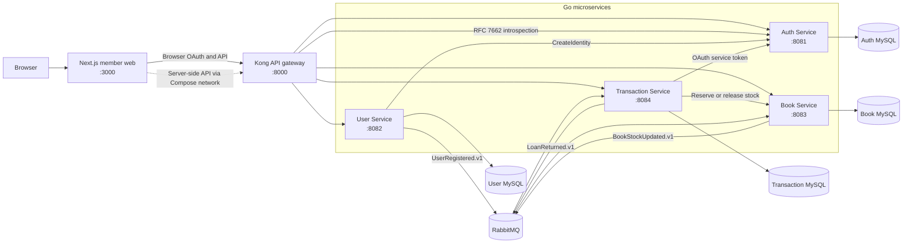

# Library Management System

A library platform built as four Go microservices, a Next.js member application,
Kong API Gateway, MySQL, and RabbitMQ. The system supports member registration,
OAuth login, catalog browsing, borrowing, returning, fines, and transaction
history.

## Quick start

### Prerequisites

- Docker Engine or Docker Desktop
- Docker Compose v2 (`docker compose`)
- Git

Node.js is not required for the default Docker workflow.

### 1. Clone the repository

```sh
git clone https://github.com/ilhamagustiawan/library-management-system.git
cd library-management-system
```

### 2. Start the complete stack

```sh
./scripts/setup.sh
```

The script validates Docker and Compose, builds every application image, starts
the stack in the background, waits for health checks, and prints the local
endpoints. It can be launched from any directory.

Open the member application at [http://localhost:3000](http://localhost:3000).

Development accounts:

| Role | Email | Password |
|---|---|---|
| Member | `member@library.com` | `password` |
| Admin | `admin@library.com` | `password` |

All checked-in credentials are local development fixtures. Never reuse them in
another environment.

### 3. Verify the stack

```sh
docker compose ps
curl --fail http://localhost:3000
curl --fail http://localhost:8000/health/readiness
```

## Database and message broker setup

Docker Compose creates isolated databases and persistent volumes. Each backend
container runs its own `migrate --action up` command before starting HTTP, so
manual schema setup is unnecessary. Development migrations also seed OAuth
clients, member/admin accounts, roles/scopes, and the book catalog.

| Component | Host port | Database or login | Persistent volume |
|---|---:|---|---|
| Auth MySQL | 3306 | `auth` / `auth_password` | `auth_mysql_data` |
| User MySQL | 3307 | `users` / `users_password` | `user_mysql_data` |
| Book MySQL | 3308 | `book` / `book_password` | `book_mysql_data` |
| Transaction MySQL | 3309 | `transactions` / `transactions_password` | `transaction_mysql_data` |
| RabbitMQ AMQP | 5672 | `library` / `library_password` | `rabbitmq_data` |
| RabbitMQ management | 15672 | `library` / `library_password` | `rabbitmq_data` |

RabbitMQ uses the durable `library.events` topic exchange. User Service
publishes `UserRegistered.v1`. Transaction Service publishes
`LoanReturned.v1`; Book Service consumes it, releases stock exactly once, and
publishes `BookStockUpdated.v1` for Transaction Service.

Useful operations:

```sh
# Follow all logs
docker compose logs --follow

# Rebuild after source changes
./scripts/setup.sh

# Stop containers while preserving data
docker compose down

# Delete containers and all local database/message data
docker compose down --volumes
```

The final command is destructive. Use it only when a clean local database is
intended.

## Local endpoints

| Component | URL |
|---|---|
| Member web | [http://localhost:3000](http://localhost:3000) |
| Kong API Gateway | [http://localhost:8000](http://localhost:8000) |
| Auth Service | [http://localhost:8081](http://localhost:8081) |
| User Service | [http://localhost:8082](http://localhost:8082) |
| Book Service | [http://localhost:8083](http://localhost:8083) |
| Transaction Service | [http://localhost:8084](http://localhost:8084) |
| RabbitMQ management | [http://localhost:15672](http://localhost:15672) |

Swagger UI is exposed through Kong:

- [Auth API](http://localhost:8000/api/v1/docs/auth/swagger)
- [User API](http://localhost:8000/api/v1/docs/users/swagger)
- [Book API](http://localhost:8000/api/v1/docs/books/swagger)
- [Transaction API](http://localhost:8000/api/v1/docs/transactions/swagger)

## Microservice architecture



Kong is the public API entry point. It routes requests, introspects access
tokens, checks endpoint scopes, removes the original bearer token, and forwards
trusted identity headers. Internal service calls use private Compose DNS names.
Each service owns its database; no service queries another service's schema.

Borrowing uses a synchronous Transaction-to-Book reservation because stock must
be decided immediately. Returning uses RabbitMQ and transactional outboxes so a
committed return survives temporary broker or Book Service failures.

## SOLID principles in the code

Go uses interfaces and composition instead of class inheritance. SOLID is
applied at the service boundaries:

| Principle | Application | Code evidence |
|---|---|---|
| **S — Single Responsibility** | HTTP handlers translate transport data, use cases own business workflows, and repositories own persistence. Returning or borrowing rules do not live in Fiber or SQL routing code. | [transaction handler](backend/transaction-service/internal/api/http/handler/transaction/handler.go#L18-L24), [transaction use case](backend/transaction-service/internal/usecase/transaction/transaction_usecase.go#L35-L46), [loan repository](backend/transaction-service/internal/infra/db/repository/loan/loan_repository.go#L22-L26) |
| **O — Open/Closed** | Transaction workflows accept repository and stock ports. A different database or Book Service adapter can be added without rewriting the use case. | [domain ports](backend/transaction-service/internal/domain/repository/loan_repository.go#L41-L58), [use-case constructor](backend/transaction-service/internal/usecase/transaction/transaction_usecase.go#L46-L69) |
| **L — Liskov Substitution** | Production adapters and in-memory test fakes satisfy the same Go interfaces and can be substituted without changing workflow behavior. | [test substitutes](backend/transaction-service/internal/usecase/transaction/transaction_usecase_test.go#L14-L71), [production wiring](backend/transaction-service/internal/server/server.go#L52-L70) |
| **I — Interface Segregation** | Consumers receive focused capabilities such as identity creation, password hashing, or stock reservation instead of depending on an entire service implementation. | [identity ports](backend/auth-service/internal/usecase/identity/identity_usecase.go#L21-L38), [registration ports](backend/user-service/internal/usecase/registration/main.go#L28-L34), [stock port](backend/transaction-service/internal/domain/repository/loan_repository.go#L55-L58) |
| **D — Dependency Inversion** | High-level use cases depend on domain interfaces. Concrete MySQL, HTTP, OAuth, and RabbitMQ adapters are selected only in each server composition root. | [use-case dependencies](backend/transaction-service/internal/usecase/transaction/transaction_usecase.go#L35-L46), [composition root](backend/transaction-service/internal/server/server.go#L42-L72) |

## OAuth 2.0 and JWT implementation

### Member Authorization Code flow

1. Next.js generates a random `state` and PKCE `code_verifier`, derives an
   S256 `code_challenge`, and stores flow state in an encrypted HttpOnly
   cookie. See [OAuth client](frontend/src/features/auth/oauth-client.ts#L61-L81).
2. The browser opens `/oauth/authorize` through Kong. Auth Service requires
   `response_type=code`, non-empty state, S256 PKCE, and an exact registered
   redirect URI. See [authorization validation](backend/auth-service/internal/infra/oauth/server.go#L222-L253).
3. After login, Auth Service returns a short-lived authorization code to the
   registered Next.js callback.
4. The Next.js server exchanges the code and verifier at `/oauth/token` using
   HTTP Basic confidential-client authentication. Container-side requests use
   `INTERNAL_GATEWAY_URL`; browser redirects retain the public `AUTH_ISSUER`.
5. Access and refresh tokens are stored only inside an AES-256-GCM sealed,
   HttpOnly, SameSite=Lax cookie. See [session encryption](frontend/src/features/auth/sealed-value.ts#L16-L60)
   and [cookie policy](frontend/src/features/auth/auth-cookies.ts#L1-L13).
6. Next.js rotates the refresh token shortly before access-token expiry. A
   failed or invalid refresh clears the local session.

### Service-to-service flow

User Service and Transaction Service use the Client Credentials grant. Their
client IDs have explicit scope and audience ceilings:

- User Service: `identities:create`, audience `auth-service`.
- Transaction Service: `book-stock:read`, `book-stock:reserve`, and
  `book-stock:release`, audience `book-service`.

Service tokens use the client ID as `sub`, contain no human role, and never
receive a refresh token.

### Scope and audience authorization

For a member token, granted scopes are the requested scopes intersected with
the OAuth client's scopes and the user's role scopes. For a service token, only
the client scope ceiling applies. All scopes in one token must target one
audience. Invalid escalation requests fail with `invalid_scope`. See
[scope resolution](backend/auth-service/internal/domain/entity/scope.go#L26-L70).

### JWT and token lifecycle

Access tokens are HS256 JWTs signed by Auth Service with a key of at least 32
bytes. Claims include:

| Claim | Meaning |
|---|---|
| `iss` | Public Auth Service issuer |
| `sub` | Member ID or service client ID |
| `aud` | Intended resource service |
| `client_id` | OAuth client that requested the token |
| `scope` | Granted space-delimited permissions |
| `role` | `member` or `admin`; omitted for service tokens |
| `iat`, `exp`, `jti` | Issue time, expiry, and unique token ID |

JWT construction is implemented in
[token.go](backend/auth-service/internal/infra/oauth/token.go#L25-L104).
Refresh tokens remain opaque random values. Authorization codes, access-token
state, and refresh-token state are persisted in Auth MySQL. Rotation removes
the previous access and refresh records, enabling immediate invalidation.

Kong validates protected browser requests through the RFC 7662 introspection
endpoint. It checks active state, expiry, issuer, audience, subject, role, and
required scope before forwarding trusted `X-Credential-*` headers. See
[Kong introspection plugin](infra/kong/plugins/lms-oauth2-introspection/handler.lua#L138-L186).
Book Service independently introspects internal Transaction Service tokens.

The system intentionally supports Authorization Code, Refresh Token, and
Client Credentials grants only. It does not implement Implicit Grant, Resource
Owner Password Credentials, OpenID Connect, or ID tokens.

## Development checks

```sh
# Frontend
cd frontend
npm ci
npm test
npm run lint
npm run build

# Each Go service
go test ./...
go vet ./...
go build ./...

# Infrastructure and setup script
docker compose config --quiet
shellcheck scripts/setup.sh
```
