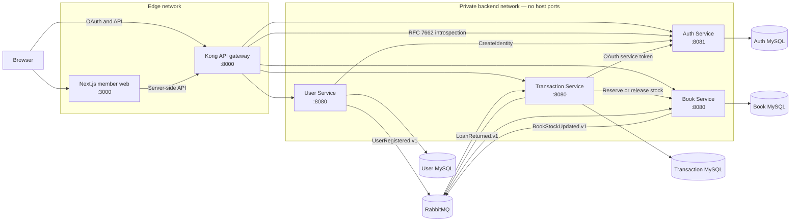
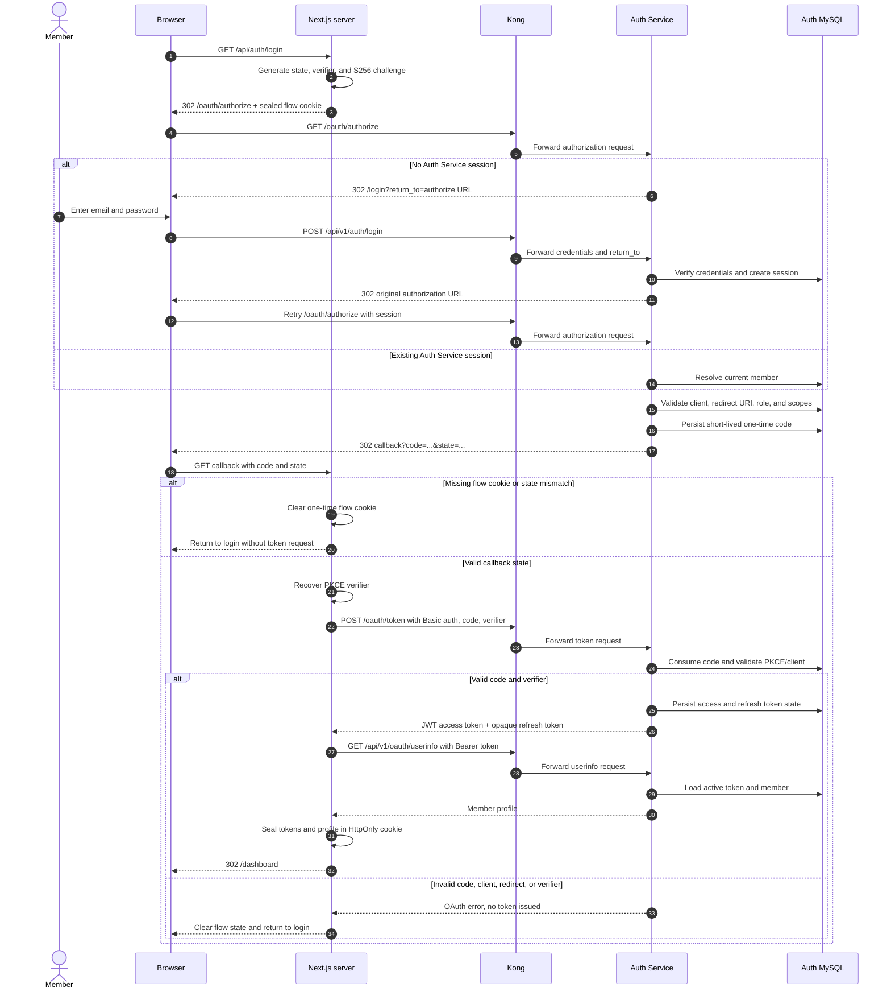
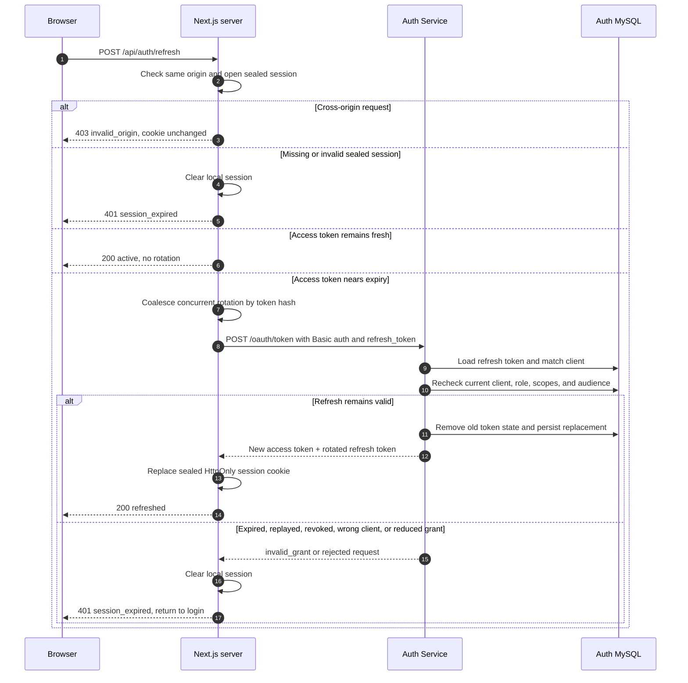
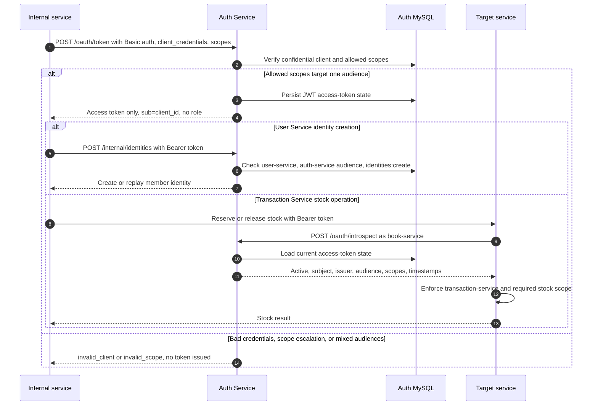

# Library Management System

A library platform built as four Go microservices, a Next.js member application,
Kong API Gateway, MySQL, and RabbitMQ. The system supports member registration,
OAuth login, catalog browsing, borrowing, returning, fines, and transaction
history.

## Showcase

[](docs/showcase/member-portal-demo.mp4)

[Watch the browser walkthrough (MP4)](docs/showcase/member-portal-demo.mp4):
member dashboard, catalog search, book details, and loan history.

## Quick start

### Prerequisites

- Docker Engine or Docker Desktop
- Docker Compose v2 (`docker compose`)
- Git

Node.js is not required for the default Docker workflow.

### 1. Clone the repository

```sh
git clone https://github.com/ilhamagustiawan/library-management-system.git
cd library-management-system
```

### 2. Start the complete stack

```sh
./scripts/setup.sh
```

The script validates Docker and Compose, builds every application image, starts
the stack in the background, waits for health checks, verifies backend services
have no host ports, and prints the local endpoints. It can be launched from any
directory.

Open the member application at [http://localhost:3000](http://localhost:3000).

Development accounts:

| Role | Email | Password |
|---|---|---|
| Member | `member@library.com` | `password` |
| Admin | `admin@library.com` | `password` |

All checked-in credentials are local development fixtures. Never reuse them in
another environment.

### 3. Verify the stack

```sh
docker compose ps
curl --fail http://localhost:3000
curl --fail http://localhost:8000/health/readiness
```

## Database and message broker setup

Docker Compose creates isolated databases and persistent volumes. Each backend
container runs its own `migrate --action up` command before starting HTTP, so
manual schema setup is unnecessary. Development migrations also seed OAuth
clients, member/admin accounts, roles/scopes, and the book catalog.

| Component | Host port | Database or login | Persistent volume |
|---|---:|---|---|
| Auth MySQL | 3306 | `auth` / `auth_password` | `auth_mysql_data` |
| User MySQL | 3307 | `users` / `users_password` | `user_mysql_data` |
| Book MySQL | 3308 | `book` / `book_password` | `book_mysql_data` |
| Transaction MySQL | 3309 | `transactions` / `transactions_password` | `transaction_mysql_data` |
| RabbitMQ AMQP | 5672 | `library` / `library_password` | `rabbitmq_data` |
| RabbitMQ management | 15672 | `library` / `library_password` | `rabbitmq_data` |

RabbitMQ uses the durable `library.events` topic exchange. User Service
publishes `UserRegistered.v1`. Transaction Service publishes
`LoanReturned.v1`; Book Service consumes it, releases stock exactly once, and
publishes `BookStockUpdated.v1` for Transaction Service.

Useful operations:

```sh
# Follow all logs
docker compose logs --follow

# Rebuild after source changes
./scripts/setup.sh

# Stop containers while preserving data
docker compose down

# Delete containers and all local database/message data
docker compose down --volumes
```

The final command is destructive. Use it only when a clean local database is
intended.

## Local endpoints

| Component | URL |
|---|---|
| Member web | [http://localhost:3000](http://localhost:3000) |
| Kong API Gateway | [http://localhost:8000](http://localhost:8000) |
| RabbitMQ management | [http://localhost:15672](http://localhost:15672) |

The four Go services have no host ports in the default Compose stack. Kong is
their only HTTP ingress.

Swagger UI is exposed through Kong:

- [Auth API](http://localhost:8000/api/v1/docs/auth/swagger)
- [User API](http://localhost:8000/api/v1/docs/users/swagger)
- [Book API](http://localhost:8000/api/v1/docs/books/swagger)
- [Transaction API](http://localhost:8000/api/v1/docs/transactions/swagger)

## Microservice architecture



Kong is the only public API entry point. The frontend shares only its edge
network; it cannot resolve or call a Go service directly. Kong routes requests,
introspects access tokens, checks endpoint scopes, removes the original bearer
token, clears client-supplied credential headers, and forwards trusted identity
headers over the internal-only backend network. Internal service calls use
private Compose DNS names. Each service owns its database; no service queries
another service's schema.

Borrowing uses a synchronous Transaction-to-Book reservation because stock must
be decided immediately. Returning uses RabbitMQ and transactional outboxes so a
committed return survives temporary broker or Book Service failures.

Every loan is due exactly seven days after `borrowedAt`. A return at or before
`dueAt` has no fine. The first instant after `dueAt` starts the first overdue day;
each started 24-hour overdue period adds IDR 5,000.

## SOLID principles in the code

Go uses interfaces and composition instead of class inheritance. SOLID is
applied at the service boundaries:

| Principle | Application | Code evidence |
|---|---|---|
| **S — Single Responsibility** | HTTP handlers translate transport data, use cases own business workflows, and repositories own persistence. Returning or borrowing rules do not live in Fiber or SQL routing code. | [transaction handler](backend/transaction-service/internal/api/http/handler/transaction/handler.go#L18-L24), [transaction use case](backend/transaction-service/internal/usecase/transaction/transaction_usecase.go#L35-L46), [loan repository](backend/transaction-service/internal/infra/db/repository/loan/loan_repository.go#L22-L26) |
| **O — Open/Closed** | Transaction workflows accept repository and stock ports. A different database or Book Service adapter can be added without rewriting the use case. | [domain ports](backend/transaction-service/internal/domain/repository/loan_repository.go#L41-L58), [use-case constructor](backend/transaction-service/internal/usecase/transaction/transaction_usecase.go#L46-L69) |
| **L — Liskov Substitution** | Production adapters and in-memory test fakes satisfy the same Go interfaces and can be substituted without changing workflow behavior. | [test substitutes](backend/transaction-service/internal/usecase/transaction/transaction_usecase_test.go#L14-L71), [production wiring](backend/transaction-service/internal/server/server.go#L52-L70) |
| **I — Interface Segregation** | Consumers receive focused capabilities such as identity creation, password hashing, or stock reservation instead of depending on an entire service implementation. | [identity ports](backend/auth-service/internal/usecase/identity/identity_usecase.go#L21-L38), [registration ports](backend/user-service/internal/usecase/registration/main.go#L28-L34), [stock port](backend/transaction-service/internal/domain/repository/loan_repository.go#L55-L58) |
| **D — Dependency Inversion** | High-level use cases depend on domain interfaces. Concrete MySQL, HTTP, OAuth, and RabbitMQ adapters are selected only in each server composition root. | [use-case dependencies](backend/transaction-service/internal/usecase/transaction/transaction_usecase.go#L35-L46), [composition root](backend/transaction-service/internal/server/server.go#L42-L72) |

## OAuth 2.0 and JWT implementation

Auth Service is the authorization server and token-state authority. Kong is the
resource gateway for browser APIs. Next.js is a confidential OAuth client: the
browser handles redirects, but client secrets and token requests remain
server-side. Internal services use separate confidential clients with narrower
grants.

### Supported grants and clients

| `grant_type` | Caller and client kind | Client authentication | Result | Used for |
|---|---|---|---|---|
| `authorization_code` | Next.js, `member-nextjs-web` (`authorization_code`) | HTTP Basic at `/oauth/token`; S256 PKCE binds code to browser flow | JWT access token and opaque refresh token | Interactive member login |
| `refresh_token` | Next.js, same client and session | HTTP Basic plus client-bound refresh token | Rotated access and refresh tokens | Renewing an expiring web session |
| `client_credentials` | User or Transaction Service (`client_credentials`) | HTTP Basic | JWT access token only | Narrow service-to-service calls |

`resource_server` is a client kind, not a grant. `kong-gateway` and
`book-service` cannot obtain tokens; their credentials authorize only RFC 7662
introspection. Unsupported grants, including Implicit and Resource Owner
Password Credentials, are rejected. OpenID Connect and ID tokens are not
implemented.

### OAuth and session endpoints

| Endpoint | Consumer | Purpose |
|---|---|---|
| `GET /oauth/authorize` | Browser through Kong | Validate client, exact callback, requested scopes, state, and S256 challenge; issue code |
| `POST /oauth/token` | Confidential clients | Exchange one of the three supported grants |
| `POST /oauth/introspect` | Provisioned resource servers | Read current access-token state using HTTP Basic |
| `GET /.well-known/oauth-authorization-server` | OAuth clients and operators | Discover issuer, endpoints, grants, response types, PKCE method, and scopes |
| `POST /api/v1/auth/login` | Browser through Kong | Create Auth Service login session, then resume authorization |
| `GET /api/v1/oauth/userinfo` | Next.js | Resolve the member represented by an active access token |

All token and introspection responses disable caching. Browser-visible
authorization redirects use `AUTH_ISSUER`; container-side token and API calls
use `INTERNAL_GATEWAY_URL` so the public issuer remains stable while private DNS
handles service traffic.

### `authorization_code`: interactive member login



Next.js stores `state` and the PKCE `code_verifier` in a short-lived sealed
HttpOnly cookie. Auth Service accepts only `response_type=code`, non-empty
`state`, `code_challenge_method=S256`, and the client's exact registered
redirect URI. Next.js validates callback state before sending the one-time code
or verifier to the token endpoint. See [OAuth client](frontend/src/features/auth/oauth-client.ts)
and [authorization validation](backend/auth-service/internal/infra/oauth/server.go).

The current frontend requests member scopes only. The seeded admin account is
available for direct OAuth/API testing, but an admin authorization request must
ask for admin scopes; mixing member and admin scopes rejects the entire request
with `invalid_scope`.

### `refresh_token`: web-session rotation



Refresh is a server-side, same-origin POST. Next.js skips rotation while the
access token remains fresh and coalesces concurrent refreshes by a hash of the
opaque token. Auth Service binds refresh state to the original client, rotates
both tokens, invalidates prior token state, and rechecks the user's current role
plus the client's current scope ceiling. Reduced permission therefore takes
effect at the next rotation instead of extending stale authority.

### `client_credentials`: internal service calls



Concrete service cases:

| Client | Requested scopes | Audience | Resource-side validation |
|---|---|---|---|
| `user-service` | `identities:create` | `auth-service` | Auth verifies active state, exact client/subject, audience, and scope before identity creation |
| `transaction-service` | `book-stock:reserve book-stock:release` | `book-service` | Book introspects through Auth, then verifies issuer, expiry, exact client/subject, audience, and operation scope |

Both callers cache service tokens until 30 seconds before expiry. A rejected
cached User Service token is cleared before retry. Service tokens set
`sub=client_id`, omit `role`, and never receive refresh tokens.

### Scope, audience, and role decisions

Every requested scope must exist in both the client's scope ceiling and, for a
human token, the current role's scope set. The resolver rejects rather than
silently dropping unauthorized scopes. Every scope in one token must also map
to one audience. See [scope resolution](backend/auth-service/internal/domain/entity/scope.go).

| Principal | Allowed development scopes | Audience |
|---|---|---|
| `member` | `books:read`, `loans:borrow:self`, `loans:return:self`, `transactions:read:self` | `library-api` |
| `admin` | `books:manage`, `fines:manage`, `loans:return:any`, `transactions:read:any` | `library-api` |
| `user-service` | `identities:create` | `auth-service` |
| `transaction-service` | `book-stock:read`, `book-stock:reserve`, `book-stock:release` | `book-service` |

### JWT and token lifecycle

Access tokens are HS256 JWTs signed by Auth Service with a key of at least 32
bytes. Claims include:

| Claim | Meaning |
|---|---|
| `iss` | Public Auth Service issuer |
| `sub` | Member ID or service client ID |
| `aud` | Intended resource service |
| `client_id` | OAuth client that requested the token |
| `scope` | Granted space-delimited permissions |
| `role` | `member` or `admin`; omitted for service tokens |
| `iat`, `exp`, `jti` | Issue time, expiry, and unique token ID |

JWT construction is implemented in
[token.go](backend/auth-service/internal/infra/oauth/token.go#L25-L104).
Refresh tokens remain opaque random values. Authorization codes, access-token
state, and refresh-token state are persisted in Auth MySQL. Rotation removes
the previous access and refresh records, enabling immediate invalidation.

Kong validates protected browser requests through the RFC 7662 introspection
endpoint. It checks active state, expiry, issuer, audience, subject, role, and
route-required scopes before stripping the bearer token and forwarding trusted
`X-Credential-*` headers. An inactive or expired token returns `401`; valid but
insufficient authority returns `403`; introspection failure or malformed active
metadata fails closed with `503`. See [Kong introspection plugin](infra/kong/plugins/lms-oauth2-introspection/handler.lua).

Access and refresh tokens never enter browser-readable storage. Next.js seals
them with AES-256-GCM in an HttpOnly, SameSite=Lax cookie; production must also
set `Secure`. See [session encryption](frontend/src/features/auth/sealed-value.ts)
and [cookie policy](frontend/src/features/auth/auth-cookies.ts).

## Development checks

```sh
# Frontend
cd frontend
npm ci
npm test
npm run lint
npm run build

# Each Go service
go test ./...
go vet ./...
go build ./...

# Infrastructure and setup script
docker compose config --quiet
shellcheck scripts/setup.sh
```
